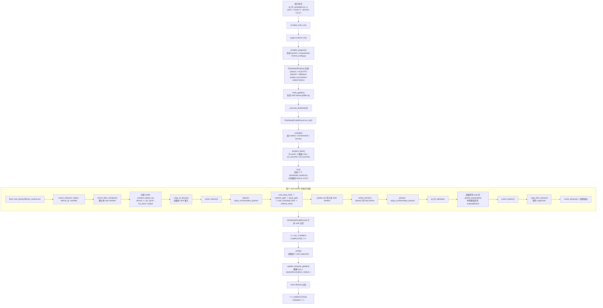

# `qwen_dist_dev` 分布式支持实现盘点与设计差距分析

## 1. 范围与结论

本文基于当前 superproject 工作区，对 5 个核心子仓库的 `qwen_dist_dev` 分支做了横向梳理，并对照 [docs/simpler_distributed_runtime_design.md](simpler_distributed_runtime_design.md) 评估实现覆盖度。

本次结论先写在前面：

- 真正与“分布式支持”直接相关的增量主要集中在 `pypto`、`pypto-lib`、`simpler`。
- `PTOAS` 和 `pto-isa` 当前 `qwen_dist_dev` 相对各自主线没有额外代码改动，更多是被上层实现直接复用，而不是本分支新增能力。
- 当前已经打通的一条用户可用链路是：
  `pypto-lib` example -> `pypto.runtime.run()` -> `simpler` 的 `DistributedCodeRunner` / `distributed_worker.py` -> `comm_*` 通信后端 -> 多卡执行 -> golden 校验。
- `simpler_distributed_runtime_design.md` 里设计的 `HostWorker / DistWorker` L3 runtime 也已经落了一套独立实现；当前 PyPTO 顶层默认走的是本次已经打通的 `DistributedCodeRunner + distributed_worker.py` 路径，而不是直接走 `HostWorker / DistWorker`，所以两者还没有统一成同一条主线。

## 2. 对比基线

本次对比基线采用各子仓库当前可见主线：

| 子仓库 | 对比分支 | `qwen_dist_dev` 领先 commit 数 | 结论 |
|---|---|---:|---|
| `PTOAS` | `upstream/main` | 0 | 无本分支特有分布式改动 |
| `pto-isa` | `origin/main` | 0 | 无本分支特有分布式改动 |
| `pypto` | `origin/main` | 2 | 有明确分布式 DSL / runtime 接入改动 |
| `pypto-lib` | `upstream/main` | 2 | 有 TP FFN 多卡 example 与交付文档改动 |
| `simpler` | `upstream/main` | 351 | 分支整体与主线差异很大，本文只抽取“分布式支持直接相关”的部分 |

说明：

- `simpler` 相对 `upstream/main` 的整体差异非常大，其中有大量 runtime、平台、CI、profiling 相关演进并不只服务于本次分布式支持。
- 因此下文对 `simpler` 的分析只统计与“多卡运行、通信、HostWorker/DistWorker、phase runner、TP FFN 落地”直接相关的实现。

## 3. 各子仓库改动梳理

### 3.1 `PTOAS`

结论：当前没有 `qwen_dist_dev` 相对主线的额外代码改动。

这意味着：

- 本次分布式支持没有要求修改汇编器侧能力。
- 上层分布式 allreduce kernel 仍然直接使用既有 `ptoas` 编译链完成构建。

### 3.2 `pto-isa`

结论：当前没有 `qwen_dist_dev` 相对主线的额外代码改动。

这意味着：

- 本次分布式支持依赖的是已有 PTO ISA / comm 相关头文件与 tile/global tensor 编程模型。
- 分支侧重点不在 ISA 扩展，而在上层 runtime、runner 和 codegen 的接线。

### 3.3 `pypto`

`pypto` 这一侧主要完成了三件事：声明式分布式程序描述、编译期 distributed codegen、运行期分布式执行接入。

#### 3.3.1 声明式分布式元数据

在 [pypto/python/pypto/language/distributed.py](../pypto/python/pypto/language/distributed.py) 中新增了：

- `BufferAttr`：描述 buffer 的分布式放置属性，例如 `placement="window"` 和 `data_prefix_elems`。
- `PhaseArg` / `tensor_arg()` / `scalar_arg()`：描述 phase 入口参数的类型。
- `DistributedLocalPhase`：把一个本地 orchestration 函数编译成一个 distributed phase。
- `DistributedAllReducePhase`：提供一个内建的 window-backed float32 sum allreduce phase。
- `DistributedRuntime`：记录 phase 执行所需 runtime 选择和环境变量。
- `DistributedProgram`：把 phase、buffer、输入输出、runtime 配置等统一挂到 `@pl.program` 上。

在 [pypto/python/pypto/language/parser/decorator.py](../pypto/python/pypto/language/parser/decorator.py) 中，`@pl.program` 已经会自动读取类属性 `DISTRIBUTED`，并在生成 IR Program 后注册这份 distributed metadata。也就是说，分布式信息已经进入了 PyPTO 的程序级编译入口，而不是 example 外挂脚本。

#### 3.3.2 编译期 distributed codegen

在 [pypto/python/pypto/backend/pto_backend.py](../pypto/python/pypto/backend/pto_backend.py) 中，分布式 codegen 已经具备以下能力：

- 将 `DistributedProgram` 序列化为 `kernel_config.py` 中的 `DISTRIBUTED_SPEC`。
- 将 `DistributedLocalPhase` 自动降成 phase orchestration C++ 代码。
- 将 `DistributedAllReducePhase` 自动生成：
  - phase orchestration 入口；
  - 一个内建的 allreduce kernel 源文件。
- 将 phase 的参数类型一并下传给 runtime，使 runner 端能够区分 `tensor` 和 `scalar` 参数。

当前这套 codegen 的价值不只是“能写 metadata”，而是已经把“phase 抽象”推到了实际产物层：

- 有 `orchestration/*.cpp`
- 有 `kernels/aiv/*.cpp`
- 有 `kernel_config.py` 里的 distributed spec

这使得 example 不再需要手工维护大段外部 orchestration C++。

#### 3.3.3 运行期接入 `simpler` 分布式 runner

在 [pypto/python/pypto/runtime/runner.py](../pypto/python/pypto/runtime/runner.py) 中，`RunConfig` 新增了多卡运行相关参数：

- `nranks`
- `root`
- `device_ids`
- `win_sync_prefix`
- `distributed_args`
- `comm_include_dirs`

当 `nranks > 1` 时，`run()` 不再走单卡 `_execute_on_device()`，而是：

1. 在编译产物中补齐默认 `DISTRIBUTED_CONFIG`；
2. 生成支持 rank-aware 初始化的 `golden.py`；
3. 调用 `_execute_distributed()`；
4. 由 `_execute_distributed()` 导入 `simpler` 的 `DistributedCodeRunner` 完成多 rank 启动。

这意味着 `pypto.runtime.run()` 已经不是“只能单卡”的入口，而是已经具备了直接拉起多卡执行的能力。

#### 3.3.4 分布式输入/输出与 golden 适配

在 [pypto/python/pypto/runtime/tensor_spec.py](../pypto/python/pypto/runtime/tensor_spec.py) 中：

- `TensorSpec` 新增 `placement`；
- 初始化 callable 可以感知 `rank` / `nranks` / `root`。

在 [pypto/python/pypto/runtime/golden_writer.py](../pypto/python/pypto/runtime/golden_writer.py) 中：

- distributed 模式下会生成 `generate_distributed_inputs(rank, nranks, root, ...)`；
- `generate_inputs(params)` 会作为兼容包装层退化到 rank-aware 初始化。

这解决了多卡场景里每个 rank 输入不同、但仍希望保留统一 golden 入口的问题。

#### 3.3.5 本仓库分布式改动小结

`pypto` 当前已经完成：

- 分布式程序描述进入 DSL。
- phase 抽象进入 codegen。
- 多卡 runner 接入顶层 `run()`。
- per-rank 初始化与 golden 校验接入。

还没有完成的是：`pypto` 顶层虽然已经具备多卡执行能力，但当前默认接入的是 `DistributedCodeRunner` 这条 phase-runner 主线，还没有直接切到 `HostWorker / DistWorker` 这套 L3 runtime。

### 3.4 `pypto-lib`

`pypto-lib` 这次承担的是“把上层模型 example 真正改成可交付的 distributed 用户样例”。

关键文件：

- [pypto-lib/examples/models/distributed/tp_ffn_quickgelu.py](../pypto-lib/examples/models/distributed/tp_ffn_quickgelu.py)
- [pypto-lib/docs/tp_ffn_multicard_hw_delivery.md](../pypto-lib/docs/tp_ffn_multicard_hw_delivery.md)

#### 3.4.1 TP FFN example 改成声明式 distributed program

当前 example 已经不再是“单独 patch 产物”的旧写法，而是直接在程序定义里声明：

- phase1: `DistributedLocalPhase(local_func="tp_ffn_local", orch_func="aicpu_orchestration_phase1")`
- phase2: `DistributedAllReducePhase(input_name="partial_out", output_name="output", orch_func="aicpu_orchestration_phase2", barrier_before=True)`
- `partial_out` 放在 `window`
- `output` 放在 `device`
- runtime 选用 `aicpu_build_graph`

这个 example 已经把以下抽象具体化了：

- tensor parallel FFN 的本地计算和跨 rank 归约分 phase 执行；
- 中间张量 `partial_out` 作为 window-backed buffer 暴露给其他 rank；
- 最终 `output` 仍然是本 rank 普通 device buffer。

#### 3.4.2 Example 本身同时承担了“产品定义样板”的作用

这个 example 的价值已经不只是一个 demo：

- 它验证了上层 DSL 描述是否足够表达 distributed phase；
- 它验证了 codegen 是否能自动产出 phase orchestration + collective kernel；
- 它验证了 `pypto.runtime.run()` 能否直接拉起 4 卡实机；
- 它提供了后续 distributed example 的参考模板。

因此从系统视角看，`pypto-lib` 在这次改动里的角色是“把编译器和 runtime 的分布式能力封装成用户可见的程序样例”。

### 3.5 `simpler`

`simpler` 是本次分布式支持最重的实现仓库，但当前实现里实际上并行存在两条线：

1. 当前已经被 `pypto.runtime.run()` 直接使用、且已经随 TP FFN 顶层入口跑通的 phase-runner 路径；
2. 按设计文档落地、但尚未接入 `pypto.runtime.run()` 默认执行链路的 `HostWorker / DistWorker` 新 runtime 路径。

这两条线都已经有代码，但抽象层级、调度模型和当前集成位置并不相同。

#### 3.5.1 phase-runner 主路径：`DistributedCodeRunner` + `distributed_worker.py`

这是当前 PyPTO 顶层多卡实际走的主路径。

关键文件：

- [simpler/examples/scripts/distributed_code_runner.py](../simpler/examples/scripts/distributed_code_runner.py)
- [simpler/examples/scripts/distributed_worker.py](../simpler/examples/scripts/distributed_worker.py)
- [simpler/python/bindings.py](../simpler/python/bindings.py)

已经实现的能力：

- `DistributedCodeRunner` 能读取 `kernel_config.py` 里的 `DISTRIBUTED_CONFIG`；
- 按 rank 生成输入文件；
- 编译 runtime / orchestration / kernel 产物；
- 为每个 rank 启动一个 Python worker 进程；
- 按 phase 顺序调用 `distributed_worker.py`；
- 在 phase 之间插入 host barrier；
- 执行后拉回输出并做 golden 校验。

`distributed_worker.py` 当前已经具备：

- `comm_init(rank, nranks, device_id, rootinfo_file)` 初始化通信；
- `comm_alloc_windows()` 为 window buffer 分配跨 rank 可见地址空间；
- `comm_get_local_window_base()` 获取本 rank 窗口基址；
- 根据 `--win-buffer` / `--dev-buffer` 分配 buffer；
- 根据 typed phase args 组装 `ChipStorageTaskArgs`；
- 逐 phase 调起 `ChipWorker.run()`；
- 执行前后 `comm_barrier()`；
- 保存输出并回收 device buffer。

这条路径的核心特点是：

- 以“进程级 per-rank worker + phase orchestration”为中心；
- Host 侧同步点显式、直观；
- 当前已经被 PyPTO 顶层入口实测跑通。

#### 3.5.2 通信后端：统一 `comm_*` Host API

关键文件：

- [simpler/src/a2a3/platform/include/host/comm.h](../simpler/src/a2a3/platform/include/host/comm.h)
- [simpler/src/a2a3/platform/onboard/host/comm_hccl.cpp](../simpler/src/a2a3/platform/onboard/host/comm_hccl.cpp)
- [simpler/src/a2a3/platform/sim/host/comm_sim.cpp](../simpler/src/a2a3/platform/sim/host/comm_sim.cpp)
- 对应的 `a5` 平台也已有同构实现

统一 Host 通信 API 已实现：

- `comm_init`
- `comm_alloc_windows`
- `comm_get_local_window_base`
- `comm_barrier`
- `comm_destroy`

其中：

- HCCL 后端负责 ACL/HCCL 初始化、rootinfo 交换、window context 提取、barrier。
- sim 后端通过 POSIX shared memory 模拟共享 window 和 barrier。

这层是这次多卡支持能够同时跑硬件和仿真的关键基础设施。

#### 3.5.3 phase 参数类型化与两阶段执行

在最近两次直接相关 commit 中，`simpler` 把 runner 路径又推进了两步：

- 支持多 phase 执行；
- 支持 phase 参数声明 `token@kind`，区分 `tensor` / `scalar`。

这使当前 distributed program 不再依赖一套隐式固定参数顺序，而是可以由 codegen 和 runner 共同约定 phase 入口签名。

对于 TP FFN，这一点尤其关键，因为：

- phase1 更适合传真实 tensor 语义；
- phase2 的内建 allreduce orchestration 当前按“设备指针 + 标量参数”工作；
- runner 必须知道哪些参数要转成 `ContinuousTensor`，哪些应当直接当 scalar / pointer 传入。

#### 3.5.3.1 TP FFN 实机命令对应的底层执行流程图

以下流程图对应已经实测打通的实机命令：

```bash
source ./set_env.sh
source ./superproject_env.sh
python3 pypto-lib/examples/models/distributed/tp_ffn_quickgelu.py \
  -p a2a3 \
  --nranks 4 \
  --devices 4,5,6,7 \
  --work-dir build_output/qwen_dist_hw_smoke
```



这张图对应的关键代码位置如下：

- 顶层入口与 `RunConfig` 组装： [pypto-lib/examples/models/distributed/tp_ffn_quickgelu.py](../pypto-lib/examples/models/distributed/tp_ffn_quickgelu.py)
- distributed phase 与 buffer placement 定义： [pypto-lib/examples/models/distributed/tp_ffn_quickgelu.py](../pypto-lib/examples/models/distributed/tp_ffn_quickgelu.py)
- `pypto.runtime.run()` 到 `_execute_distributed()` 主链路： [pypto/python/pypto/runtime/runner.py](../pypto/python/pypto/runtime/runner.py)
- 多卡编译、拉起 worker、汇总日志、golden 校验： [simpler/examples/scripts/distributed_code_runner.py](../simpler/examples/scripts/distributed_code_runner.py)
- 每个 rank 的通信初始化、buffer 分配、phase 执行、输出保存： [simpler/examples/scripts/distributed_worker.py](../simpler/examples/scripts/distributed_worker.py)

#### 3.5.4 `HostWorker / DistWorker` 新 runtime

关键文件：

- [simpler/src/common/distributed/dist_worker.h](../simpler/src/common/distributed/dist_worker.h)
- [simpler/src/common/distributed/dist_orchestrator.cpp](../simpler/src/common/distributed/dist_orchestrator.cpp)
- [simpler/src/common/distributed/dist_scheduler.cpp](../simpler/src/common/distributed/dist_scheduler.cpp)
- [simpler/src/common/distributed/dist_sub_worker.cpp](../simpler/src/common/distributed/dist_sub_worker.cpp)
- [simpler/python/host_worker/host_worker.py](../simpler/python/host_worker/host_worker.py)
- [simpler/python/worker.py](../simpler/python/worker.py)
- [simpler/python/bindings/dist_worker_bind.h](../simpler/python/bindings/dist_worker_bind.h)

这套 runtime 已经实现的核心能力包括：

- `IWorker` / `WorkerPayload` / `WorkerType` 抽象；
- `DistTensorMap`：以 base_ptr 为 key 的 producer 跟踪；
- `DistRing`：带 back-pressure 的 task slot allocator；
- `DistScope`：scope 引用计数释放；
- `DistOrchestrator`：提交时做 fanin/fanout 建边与 ready task 入队；
- `DistScheduler`：独立 scheduler thread + per-worker worker thread；
- `DistSubWorker`：C++ 侧 mailbox dispatch + TASK_DONE 轮询；
- `HostWorker`：Python 侧 fork/subprocess/mailbox 管理；
- `Worker(level=2/3)`：统一 facade。

从代码结构上看，这已经是一套完整的 L3 runtime skeleton，而不是单纯的 POC。

#### 3.5.5 `aicpu_build_graph` runtime 为 distributed phase 打补丁

TP FFN 跑通还依赖了 `aicpu_build_graph` runtime 侧的补丁，关键文件包括：

- [simpler/src/a2a3/runtime/aicpu_build_graph/runtime/runtime.h](../simpler/src/a2a3/runtime/aicpu_build_graph/runtime/runtime.h)
- [simpler/src/a2a3/runtime/aicpu_build_graph/runtime/runtime.cpp](../simpler/src/a2a3/runtime/aicpu_build_graph/runtime/runtime.cpp)
- [simpler/src/a2a3/runtime/aicpu_build_graph/host/runtime_maker.cpp](../simpler/src/a2a3/runtime/aicpu_build_graph/host/runtime_maker.cpp)
- [simpler/src/a2a3/runtime/aicpu_build_graph/aicpu/aicpu_executor.cpp](../simpler/src/a2a3/runtime/aicpu_build_graph/aicpu/aicpu_executor.cpp)

这部分主要解决：

- distributed phase orchestration 的动态入口函数名支持；
- device orchestration 需要的 args / SO / GM heap / shared memory 初始化；
- phase runtime 和 kernel binary 的装载；
- TP FFN phase1 / phase2 能真正进入 runtime 执行，而不是被入口名硬编码挡住。

## 4. 目前已经实现出的系统能力

把三个主仓串起来看，目前为了做分布式支持，已经实际落地的内容可以归纳成以下 8 点。

### 4.1 程序级 distributed 描述能力

已经可以在 `@pl.program` 上直接声明：

- 分布式 phase 列表；
- 输入输出；
- buffer placement；
- runtime 配置；
- 通信 include；
- phase 参数签名。

这是从“example 级手工 patch”到“编译器理解 distributed program”的关键一步。

### 4.2 phase-based 多卡执行模型

当前真正跑通的执行模型是：

1. 每个 rank 先执行 phase1 本地算子；
2. host barrier；
3. 每个 rank 再执行 phase2 通信/归约；
4. host barrier；
5. 保存输出并校验。

这套模型目前已经在 TP FFN 上被顶层入口验证过。

### 4.3 window / device 双 buffer 放置模型

现在上层已经能显式区分：

- `window`：跨 rank 可见，适合 phase 间通信输入；
- `device`：本 rank 本地输出；
- `data_prefix_elems`：为协议前缀或逻辑数据偏移预留隐藏空间。

这使 window 逻辑地址模型第一次进入了上层 DSL 和 runner 配置，而不是只存在于底层通信实现。

### 4.4 backend-neutral 通信抽象

`comm_*` 把硬件 HCCL 后端与 sim 后端统一在一个 Host API 上，runner 无需区分后端细节。

这个抽象现在已经足够支撑：

- rootinfo 交换；
- 窗口分配；
- 获取本地窗口基址；
- barrier；
- destroy。

### 4.5 分布式 codegen

PyPTO 已经能自动生成：

- distributed orchestration C++；
- builtin allreduce kernel；
- kernel_config distributed spec。

这说明 distributed 不是单纯 runtime 拼装，而是已经进入编译期产物。

### 4.6 rank-aware 输入生成与 golden 校验

现在每个 rank 的输入初始化可以依赖：

- `rank`
- `nranks`
- `root`

执行后也可以按 rank 取回输出并和 golden 做逐 rank 校验。

### 4.7 L3 `HostWorker / DistWorker` runtime skeleton

虽然它还不是 PyPTO 顶层默认执行后端，但已经具备：

- task submit；
- tensormap 依赖推断；
- scope 生命周期；
- scheduler / worker thread；
- subworker fork + shm dispatch；
- Python API 封装。

这意味着设计文档中的 L3 runtime 不是空文档，已经有较系统的代码落地。

### 4.8 针对 TP FFN 的端到端用户样例

`pypto-lib` 的 TP FFN example 已经把分布式能力包装成一个可复现、可验证的上层程序，而不是只存在于底层 unit test 或脚本。

## 5. 当前系统的真实主路径

结合当前代码，实际最重要的一点是：**“已经跑通的用户主路径”和“按设计稿推进的通用 L3 runtime”不是同一条执行链。**

### 5.1 当前已跑通主路径

当前 PyPTO 顶层多卡执行的实际链路是：

1. 用户运行 [pypto-lib/examples/models/distributed/tp_ffn_quickgelu.py](../pypto-lib/examples/models/distributed/tp_ffn_quickgelu.py)
2. `pypto.runtime.run()` 编译程序并补 `DISTRIBUTED_CONFIG`
3. `_execute_distributed()` 调用 `simpler` 的 `DistributedCodeRunner`
4. `DistributedCodeRunner` 编译产物、准备 per-rank 输入、起多个 `distributed_worker.py`
5. 每个 rank 的 `distributed_worker.py`：
   - 初始化 `comm_*`
   - 分配 window / device buffer
   - 逐 phase 调用 `ChipWorker`
   - barrier
   - 保存输出
6. `DistributedCodeRunner.verify()` 做多 rank golden 校验

这是一条已经打通并被 PyPTO 顶层默认使用的 phase-runner 路径。

### 5.2 当前并行存在但尚未并入主路径的能力

同时，`simpler` 中还存在另一条能力线：

- `HostWorker`
- `Worker(level=3)`
- `DistWorker`
- `DistScheduler`
- `DistTensorMap`
- `DistScope`

它更接近 [docs/simpler_distributed_runtime_design.md](simpler_distributed_runtime_design.md) 描述的 L3 runtime。

但当前 PyPTO 顶层 distributed `run()` 还没有直接走这条线，而是仍然走前面的 phase-runner 主路径。

### 5.3 这两条路径的区别

虽然两条路径都服务于“分布式执行”，但它们并不是同一层抽象上的重复实现。

| 维度 | phase-runner 主路径 | `HostWorker / DistWorker` 路径 |
|---|---|---|
| 当前入口 | `pypto.runtime.run()` -> `_execute_distributed()` -> `DistributedCodeRunner.run_all()` | `Worker(level=3)` / `HostWorker` / `DistWorker` |
| 面向对象 | 一个已经编译完成的 distributed example / job | 一个通用分布式任务运行时 |
| 核心执行单元 | per-rank Python worker 进程 + `ChipWorker.run()` | `DistWorker` + `DistScheduler` + `ChipWorker` / `DistSubWorker` |
| 调度模型 | 显式 phase 顺序执行，phase 间 host barrier | 运行时 DAG 调度，按输入输出依赖自动推断 ready/fanin/fanout |
| 依赖表达 | `DISTRIBUTED_CONFIG`、phase 列表、`window/device` buffer placement | `submit(inputs=[...], outputs=[...])` + `TensorMap` + `Scope` |
| 当前与 PyPTO 集成状态 | 已接入，且 TP FFN 顶层实机/仿真已验证 | 已有代码和测试，但还不是 PyPTO 顶层默认执行后端 |

因此，当前系统不是“两套都在跑同一件事”，而是：

- `DistributedCodeRunner + distributed_worker.py` 负责把当前 distributed program 真正跑起来。
- `HostWorker / DistWorker` 代表另一套更通用、更接近设计稿目标的 L3 task runtime。
- 两者未来可以收敛，但今天还没有统一。

## 6. 对照设计文档：哪些已经实现，哪些还没实现

下面按照设计文档的关键目标做对照。

### 6.1 已实现或基本实现

| 设计项 | 当前状态 | 说明 |
|---|---|---|
| L3 有独立 DistWorker 调度引擎 | 已实现 | `dist_worker` / `dist_orchestrator` / `dist_scheduler` / `dist_tensormap` / `dist_scope` 已落代码 |
| 统一 `IWorker` 抽象 | 已实现 | `IWorker::run(const WorkerPayload&)` 已存在 |
| Scheduler thread + per-worker thread 模型 | 已实现 | `DistScheduler` 与 `WorkerThread` 已实现 |
| TensorMap 自动依赖推断 | 已实现 | `DistOrchestrator::submit()` 已按输入 base_ptr 找 producer |
| scope 生命周期管理 | 已实现 | `DistScope` + `scope_begin/scope_end` 已实现 |
| fork before threading | 已实现 | `HostWorker.init()` 先 fork，再 `DistWorker.init()` |
| SubWorker 无需 pickle callable | 已实现 | callable 在 fork 前注册，子进程继承 registry |
| PyPTO 程序级 distributed metadata | 已实现 | `DISTRIBUTED = pl.DistributedProgram(...)` 已生效 |
| phase codegen | 已实现 | `DistributedLocalPhase` / `DistributedAllReducePhase` 已自动生成产物 |
| 多卡 phase runner | 已实现 | PyPTO 顶层已经能直接调用 `DistributedCodeRunner` |
| 硬件 / 仿真通信后端 | 已实现 | `comm_hccl.cpp` + `comm_sim.cpp` 已接入 runner |

### 6.2 部分实现

| 设计项 | 当前状态 | 差在哪里 |
|---|---|---|
| 统一 Worker Python API | 部分实现 | `Worker(level=2/3)` 已有，但 `HostWorker` 仍使用 `execute()`；高层接口尚未彻底统一成设计稿里的同形态 `run(task)` |
| HostSubWorker fork+shm tensor zero-copy | 部分实现 | fork/shm 和 callable 继承已做，但 HostWorker mailbox 目前只传 `callable_id`，没有完整 tensor/scalar args/result shm 协议 |
| L3 与 L2 完全同构 | 部分实现 | 结构上在靠近，但 `DistTensorMap`、输出 buffer 分配、调度通知等仍是简化版 |
| Scheduler “ready/completion 统一 CV 驱动” | 部分实现 | 当前 `DistScheduler` 主要靠 completion CV + 1ms wait 循环，不是设计稿那种 ready/completion 完全统一事件模型 |
| PyPTO 顶层与 DistWorker 直接贯通 | 部分实现 | PyPTO 顶层多卡已可用，但现在走的是 `DistributedCodeRunner`，不是 `HostWorker/DistWorker` 主链 |

### 6.3 尚未实现

| 设计项 | 当前状态 | 证据 |
|---|---|---|
| `Worker(level=4, ...)` / L4 递归组合 | 未实现 | [simpler/python/worker.py](../simpler/python/worker.py) 当前只支持 level 2 和 level 3 |
| DistWorker 作为高层子 worker 真正执行 `run(payload)` | 未实现 | [simpler/src/common/distributed/dist_worker.cpp](../simpler/src/common/distributed/dist_worker.cpp) 中 `DistWorker::run()` 还是 placeholder |
| HostSubWorker 完整 mailbox 协议（args shm fd / offset / result addr / error msg） | 未实现 | 当前 mailbox 只覆盖 state / callable_id / error_code，和设计稿 256B 完整协议不一致 |
| 基于 DistWorker 的 L4+/多机扩展 | 未实现 | 代码里没有多 host 递归调度落地 |
| PyPTO 默认多卡执行切换到 HostWorker/DistWorker | 未实现 | `pypto.runtime.run()` 仍然走 `DistributedCodeRunner` |

## 7. 我认为最关键的设计差距

从“是否符合设计稿”看，目前最重要的不是零碎 API 缺口，而是下面 4 个结构性差距。

### 7.1 已跑通主路径仍是 phase-runner，而不是设计稿里的 DistWorker 主路径

这意味着：

- 设计稿里的 L3 runtime 已经有代码，但还不是当前产品主路径。
- 用户层目前默认得到的是“顶层可直接调用的 phase-runner”，不是“统一 worker tree runtime”。

这不是坏事，但文档上必须明确，不然容易把“设计实现了”和“产品主路径用了”混为一谈。

### 7.2 `HostWorker` 目前更像“SubWorker + DistWorker 的 Python 封装”，还不是完整的多 chip Host runtime

设计稿里 `HostWorker` 应该统一管理：

- ChipWorker x N
- SubWorker x M
- host-side orch/scope/ring/tensormap

但当前 [simpler/python/host_worker/host_worker.py](../simpler/python/host_worker/host_worker.py) 只接 `num_sub_workers`，没有把 chip worker 作为这个类的稳定外部接口暴露出来。

也就是说，`HostWorker` 这层目前仍偏 POC/中间态。

### 7.3 SubWorker 的数据传输协议还没走到设计稿定义的完整形态

设计稿希望 SubWorker mailbox 能带：

- task state
- callable_id
- args shm fd / offset
- result addr
- error code / error msg

当前实现只传 callable id，并依赖 fork 继承或外部共享内存让 callable 自己取数据。

这说明：

- callable 调度已经打通；
- 但“HostSubWorker 成为真正通用的 host 计算 worker”还差最后一层参数/结果协议。

### 7.4 L4 递归组合与多机扩展还没有开始进入真实实现

这部分不是“还没和 PyPTO 接起来”，而是 runtime 本身还没有做。

因此如果严格按设计稿衡量：

- L3：已有骨架和不少关键机制
- L4+：仍停留在设计目标

## 8. 当前最值得确认的“已实现边界”

为了避免后续继续讨论时目标漂移，我建议把当前边界明确成下面这句话：

> 当前 `qwen_dist_dev` 已经完成的是“PyPTO 顶层可声明 distributed program，并通过 Simpler 的 `DistributedCodeRunner + distributed_worker.py` phase-runner 主路径在多卡上执行并校验”；同时在 `simpler` 内部已经实现了一套 L3 `HostWorker/DistWorker` 调度骨架，但它目前还没有接入 PyPTO 顶层默认执行链路，也还没有扩展到 L4+。

这个表述基本符合当前代码事实。

## 9. 建议的后续实现顺序

如果后面要继续沿设计稿推进，我建议优先级如下。

### 9.1 先决定“主路径到底是哪条”

需要先明确：

- 继续把 `DistributedCodeRunner` 作为正式多卡主路径，并把 phase 模型抽象做完整；
- 还是把 `HostWorker/DistWorker` 提升成主路径，再让 phase 逻辑映射到它之上。

这一步如果不先定，后面很容易形成两套并行 runtime。

### 9.2 如果目标是收敛到设计稿，应优先补齐这三个点

建议优先实现：

1. `HostWorker` 正式纳入 ChipWorker 管理接口；
2. SubWorker mailbox 扩展到可传 typed args/result；
3. PyPTO 顶层 distributed `run()` 可以直接选择 DistWorker backend。

做到这三点后，设计稿与用户主路径才会真正开始合一。

### 9.3 之后再考虑 L4 / 多机

在 L3 主路径未收敛前，直接推进 L4 容易把复杂度放大。

更合理的顺序是：

1. L3 主路径统一；
2. phase / collective 抽象稳定；
3. 再向 L4 递归组合扩展。

## 10. 本次盘点后的总评

如果只看“有没有为分布式支持做出系统性实现”，答案是明确的：**有，而且已经跨 `pypto`、`pypto-lib`、`simpler` 三层形成了一条真实可运行链路。**

但如果按 [docs/simpler_distributed_runtime_design.md](simpler_distributed_runtime_design.md) 的目标形态来打分，则更准确的判断是：

- phase-runner 路径：已经可用，并完成了 TP FFN 的端到端验证；
- L3 `HostWorker/DistWorker`：已经完成核心骨架与关键机制，但还未成为默认主路径；
- L4+/多机递归 runtime：还没有真正实现。

因此当前阶段最准确的描述不是“分布式 runtime 全部做完了”，而是：

**分布式支持已经做出了第一条完整可用链路，同时做出了一套更通用的 L3 runtime 雏形；下一阶段的核心任务是把两条线收敛。**
